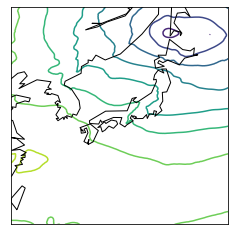

## How to Obtain and Use Numerical Forecast Maps

In this section, we describe how to download the numerical weather maps used in the experiments of [our paper](https://aclanthology.org/2021.eacl-main.125.pdf) and how to use the data.

### Step1. Download numerical forecast maps

The numerical forecast maps used in the experiment for the years 2014-2015 for the area around Japan are listed in `gpvfile_download_url.csv`.
To obtain the numerical forecast maps, please use the script to download them from the [website](http://database.rish.kyoto-u.ac.jp/arch/jmadata/data/gpv/original/) as below.

**Note**: These data were collected and distributed by [Research Institute for Sustainable Humanosphere, Kyoto University](http://database.rish.kyoto-u.ac.jp/index-e.html). 

```sh
# Usage
# $./download_gpvdata_files.sh [download_url_list] [path_to_save_dir]
$./download_gpvdata_files.sh ./gpvfile_download_url.csv ./gpvdata/
```

Then, you can find binary files such as `Z__C_RJTD_20140101000000_GSM_GPV_Rjp_Lsurf_FD0000-0312_grib2.bin` in `./gpvdata/20140101/` (directory).


### Step2. Convert binary files to grib2 format

The next step is to convert the downloaded binary file into a format called grib2, which is a file format for the storage and transport of gridded meteorological data.  
If you want to know more about grib format, please refer to [this page](https://eccc-msc.github.io/open-data/msc-data/readme_grib_en/) for example.  

Please specify the path to the downloaded file as shown below.  

```sh
# Usage
# $./convert_bin2grib.sh [path/to/GPV_RAWDATA_DIR]
$./convert_bin2grib.sh ./gpvdata/
```

**Note**: Please install `wgrib2` command  by referring to [here](https://www.cpc.ncep.noaa.gov/products/wesley/wgrib2/) in advance.
For macOS, you can install `wgrib2` command with [MacPorts](https://ports.macports.org/port/wgrib2/).


### Step3. Visualize numerical forecaset maps

Finally, we visualize the weather data on a map around Japan with [pygrib](https://github.com/jswhit/pygrib), a Python interface for reading and writing GRIB files.


The obtained numerical forecast maps contain hourly forecast data of various physical quantities for the next 84 hours.  
For example, the way to obtain and visualize the data for mean-sea-level (MSL) pressure at 0 hour later (forecast time) is as follows.  

```py
import pygrib
import numpy as np

import matplotlib.pyplot as plt
from mpl_toolkits.basemap import Basemap

# Visualise a file, converted to grib2 format in Step 2.
path_to_grib_file = "./gpvdata/20140101/Z__C_RJTD_20140101060000_GSM_GPV_Rjp_Lsurf_FD0000-0312_grib2.bin.grib2"

# get data of mean-sea-level pressure at forecast time 0
grbs = pygrib.open(path_to_grib_file)
grb = grbs.select(name="Pressure reduced to MSL")[0]

lats, lons = grb.latlons()
mslp = grb.values

flat_lats= np.ravel(lats)
flat_lons= np.ravel(lons)

fig = plt.figure()
m = Basemap(
    llcrnrlat=lats.min(), 
    urcrnrlat=lats.max(), 
    llcrnrlon=lons.min(), 
    urcrnrlon=lons.max()
)

# set contour line on map
m.contour(flat_lons, flat_lats, mslp, latlon=True, tri=True)
# set coastline on map
m.drawcoastlines() 

plt.show()
```

In this way, the mean-sea-level pressure is plotted on the map around Japan.  

